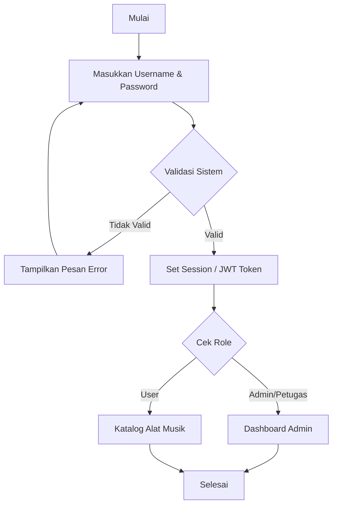
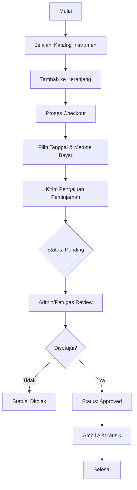
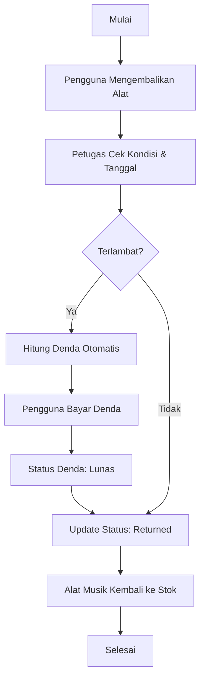

# Dokumentasi Flowchart - Sistem Peminjaman Alat Musik

Dokumen ini menjelaskan alur kerja utama dalam sistem peminjaman alat musik, yang meliputi proses Login, Peminjaman (Peminjaman), dan Pengembalian (Pengembalian).

---

## 📊 Ikhtisar Visual (Infographic)
Sebuah infografis flowchart profesional telah dibuat untuk referensi cepat:

---

## 🔐 1. Alur Login (Login Flowchart)
Proses dimulai saat pengguna memasukkan kredensial untuk mengakses sistem.

---

## 🎸 2. Alur Peminjaman (Rental Flowchart)
Proses dari memilih alat musik hingga mendapatkan persetujuan dari admin.

---

## 🔁 3. Alur Pengembalian (Return Flowchart)
Proses pengembalian alat musik dan penyelesaian denda jika terlambat.

---

> [!NOTE]
> Semua alur di atas terintegrasi dalam database sistem untuk memastikan stok alat musik dan riwayat peminjaman selalu akurat.
